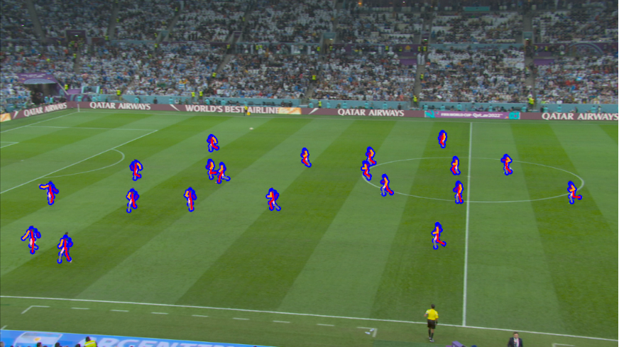

# WorldPose Dataset Pre-processing Tools



> Note that this is not an official preprocessing tool for the WorldPose dataset.  
> This repo is created for a more easy way of running 3D human pose estimation pipelines. 

This is a repo for processing worldpose dataset into the format required for 3D human pose estimation. Please refer to [MotionBERT](https://github.com/Walter0807/MotionBERT/blob/main/docs/pose3d.md) and [LCN](https://github.com/CHUNYUWANG/lcn-pose#data) for the reason why we prepare dataset int this way and more details.


## Dataset

This repo **do not** provide the download of original worldpose dataset. Please register to the official [WorldPose Website](https://eth-ait.github.io/WorldPoseDataset/) and download the dataset in its original format. 

After registration, you should receive:
- Annotation File
- Camera Footage

**Annotation File folder structure:**

please unzip the 7z file `cameras-dev.7z` and `poses-dev.7z` into folder `cameras` and `poses` respectively. The folder structure should look like this:

```
WorldPose
├── cameras
├── poses
├── FIFA-Skeletal-Tracking-Light-Content-Licence.pdf
└── README.md
```

**Video Footage folder structure:**

You should also receive a Video Footage file. Please make sure the folder structure looks like this:

```
FIFA Skeletal Light - Camera 1 Footage
├── README.pdf
├── ChallengeTest
│ ├── compressed
│ └── raw
├── ChallengeVal
│ ├── compressed
│ └── raw
├── doc
│ ├── Challenge.pdf
│ └── WorldPose.pdf
└── WorldPoseDataset
    ├── compressed
    └── raw
```

## Requirements

Tools like `HRNet` and `YOLO3` are used for 2D pose estimation. Please download pretrained models of HRNet and YOLOv3 (`pose_hrnet_w48_384x288.pth` and `yolov3.weights`) from [here](https://drive.google.com/drive/folders/1_ENAMOsPM7FXmdYRbkwbFHgzQq_B_NQA).
Put them in the `./Dete2D/lib/checkpoint/` directory.

Besides, this repository also do not provide the SMPL models. You need to register the SMPL human body models. After acquiring the SMPL model from [SMPL](https://smpl.is.tue.mpg.de/) and [SMPLX](https://smpl-x.is.tue.mpg.de/) , please put them in the `models` folder. The folder structure should look like this:

```
models
├── smpl
│ ├── SMPL_FEMALE.pkl
│ ├── SMPL_MALE.pkl
│ └── SMPL_NEUTRAL.pkl
└── smplx
 ├── SMPLX_FEMALE.npz
 ├── SMPLX_FEMALE.pkl
 ├── SMPLX_MALE.npz
 ├── SMPLX_MALE.pkl
 ├── SMPLX_NEUTRAL.npz
 └── SMPLX_NEUTRAL.pkl

```

## Environment

This project is developed under the following environment:
- Python 3.9.21

For installation of the project dependencies, please execute:

```
pip install -r requirements.txt
```

## Usage

### Step 1

This project processes the worldpose dataset based on each game. You should provide the game name and the game-based result will save into `./worldpose_preprocess_output/` folder by default. Please run:

First, in `worldpose_preprocess.py` file, you should change the variables:

- `raw_video_dir`: the path to the raw video footage
- `pose_anno_dir`: the path to the annotation file
- `cam_anno_dir`: the path to the camera parameters file

to the path on your device.

Then you can start executing the processing. For example, if you want to process the game `ARG_FRA_181108`, please run:

```
python worldpose_preprocess.py --game-name="ARG_FRA_181108"
```

We generate the 2D detection results with HRNet. In some cases, the HRNet detection fails with detection results locating outside the images. In this situation, we use the GroundTruth annotations to replace the detection results of that joint point.


### Step 2

After all the games are processed, you can rearrange the frame-based results into the player-based results. Please run:

```
python worldpose_rearrange.py
```


> Note that the train and test set is split manually with these games into test set and the remaining into train set. The selection is by random and only keep the ratio similar to Human3.6M dataset.
> 
>'ARG_CRO_221657','ARG_CRO_222132','ARG_CRO_223805','ARG_CRO_235121','ARG_FRA_180702','ARG_FRA_183429','ARG_FRA_193158','BRA_KOR_221807','BRA_KOR_232126','BRA_KOR_224459','CRO_MOR_181141','CRO_MOR_182854','CRO_MOR_184559','CRO_MOR_194948','ENG_FRA_224248','ENG_FRA_233519','ENG_FRA_232015','ENG_FRA_235059','FRA_MOR_232451','FRA_MOR_222923','MOR_POR_181952','MOR_POR_192030','MOR_POR_184724','NET_ARG_220032','NET_ARG_231259','NET_ARG_222749',
> 
> You can change this in `worldpose_rearrange.py` file.

### Step 3

With the train and test set split, the final source file will be generated in this step. Please run:

```
python worldpose_source_generate.py
```

The final output will be saved in current directory as:
- `wp_hr_conf_cam_source_final.pkl`
- `wp_no_conf_cam_source_final.pkl`

